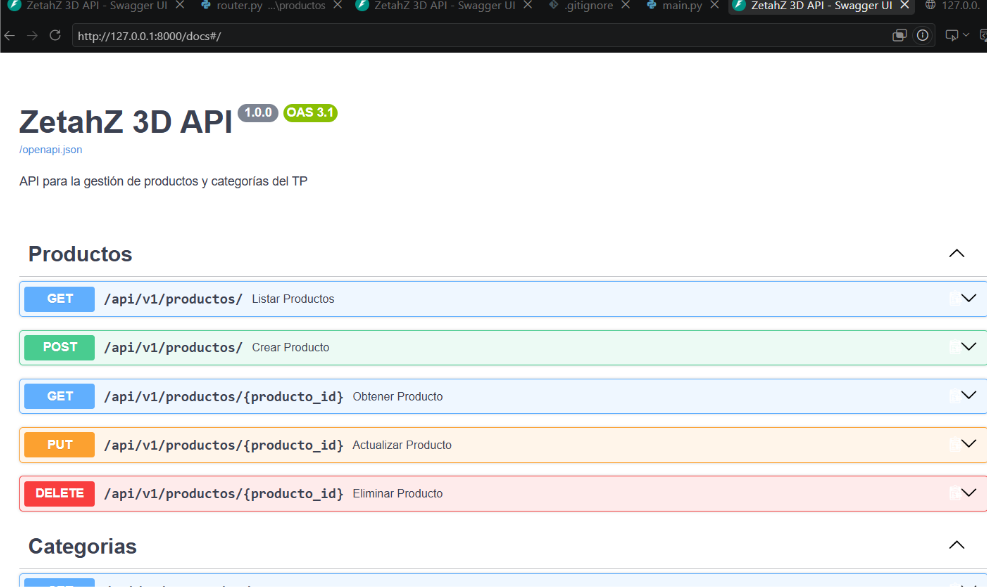
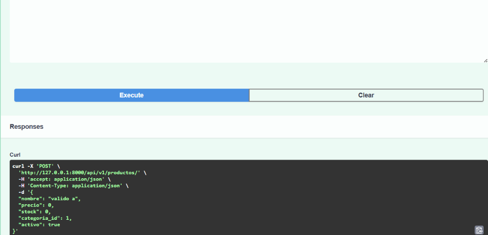
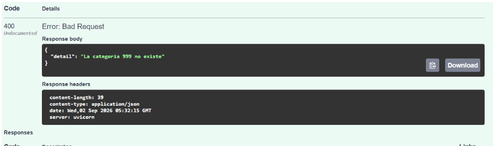
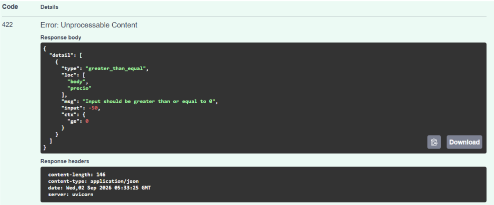
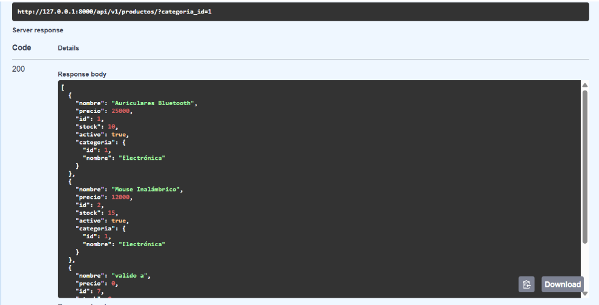
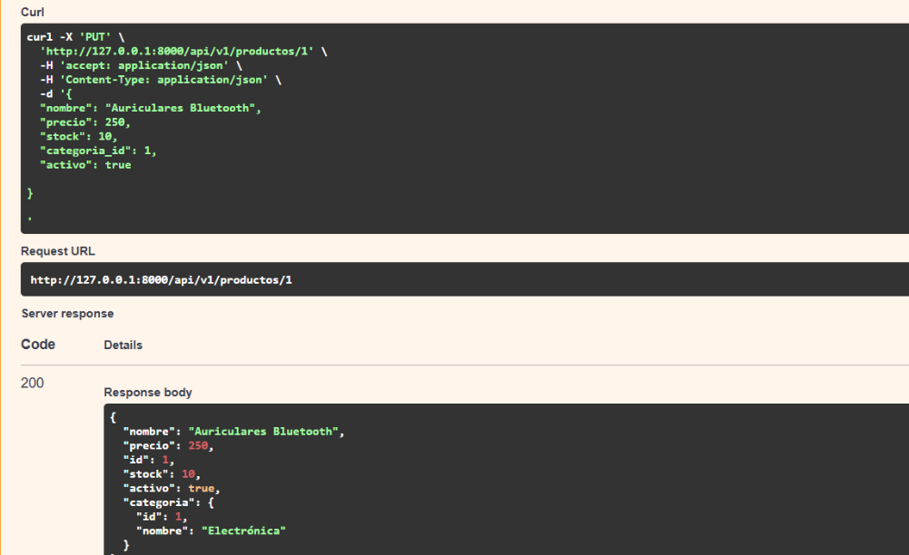
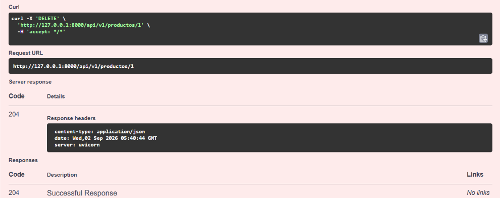

# API de Gestión de Productos y Categorías - FastAPI

Trabajo práctico desarrollado con una arquitectura modular por capas, utilizando **FastAPI** para la creación de la API, **Pydantic** para la validación de datos y el **Patrón Repository** para separar la lógica de negocio y persistencia.

---
## Integrantes 

Mejia Fabrizio : https://github.com/ZetahZ
Gutierrez Jose Maria : https://github.com/Gutierrez-Jose-M
Arapa Dillan Luigi A. : https://github.com/ArapaDillan10


## Estructura del Proyecto
```text
tp-productos-api/
│
├── app/
│   ├── api/
│   │   └── v1/
│   │       ├── categorias/
│   │       └── productos/
│   ├── core/
│   ├── models/
│   ├── schemas/
│   └── main.py
│
├── .gitignore
├── README.md
└── requirements.txt
```

# Para levantar la api en la terminal ejecutar los siguientes codigos paso a paso.

Primera y unica vez;
# paso 0  
Set-ExecutionPolicy -Scope Process -ExecutionPolicy RemoteSigned

# Paso 1

python -m venv venv
venv\Scripts\Activate.ps1

# Paso 2
pip install fastapi uvicorn pydantic

# Paso 3
pip install "fastapi[standard]"

# Paso 4
Set-ExecutionPolicy -Scope Process -ExecutionPolicy RemoteSigned

# Paso 5
fastapi dev app/main.py

# Paso 6 
venv\Scripts\Activate.ps1 








